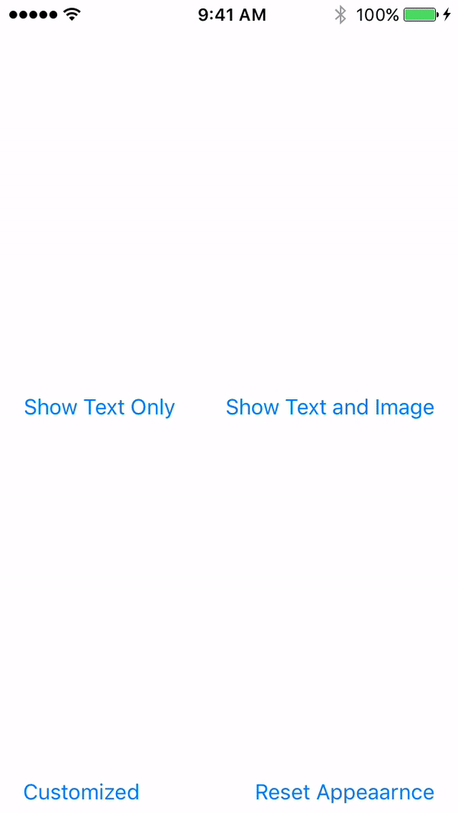

# PopupOverlay

Based on [SwiftOverlays](https://github.com/peterprokop/SwiftOverlays) done by peterprokop.

### A popup message that dims the background and displays text and image.



## Install

#### Cocoa Pods
Requires Cocoapods 1.5.0 or above.

```ruby
target '<you project target>' do
    pod 'PopupOverlay'
end
```
#### Manually

Just copy these files into your project:
- [x] PopupOverlay.swift
- [x] UILabel+PopupOverlay.swift
- [x] UIView+PopupOverlay.swift

## Usage example

```swift
let popupOverlay = PopupOverlay()

popupOverlay.showPopupOverlay(text: "Lorem ipsum dolor sit amet!!!",
                              image: UIImage(named: "Apple")!)
```

For customizing the popup, change the public attributes before calling 'showPopupOverlay':
```swift
let popupOverlay = PopupOverlay()

popupOverlay.backgroundColor = UIColor.init(red: 0, green: 128, blue: 0, alpha: 0.3)
popupOverlay.textColor = UIColor.red
popupOverlay.font = UIFont.systemFont(ofSize: 20.0)
popupOverlay.padding = CGFloat(30)
popupOverlay.cornerRadius = CGFloat(30)

popupOverlay.showPopupOverlay(text: "Lorem ipsum dolor sit amet!!!",
                              image: UIImage(named: "Apple")!)
```

## License

This project is licensed under the MIT License - see the [LICENSE](LICENSE) file for details
